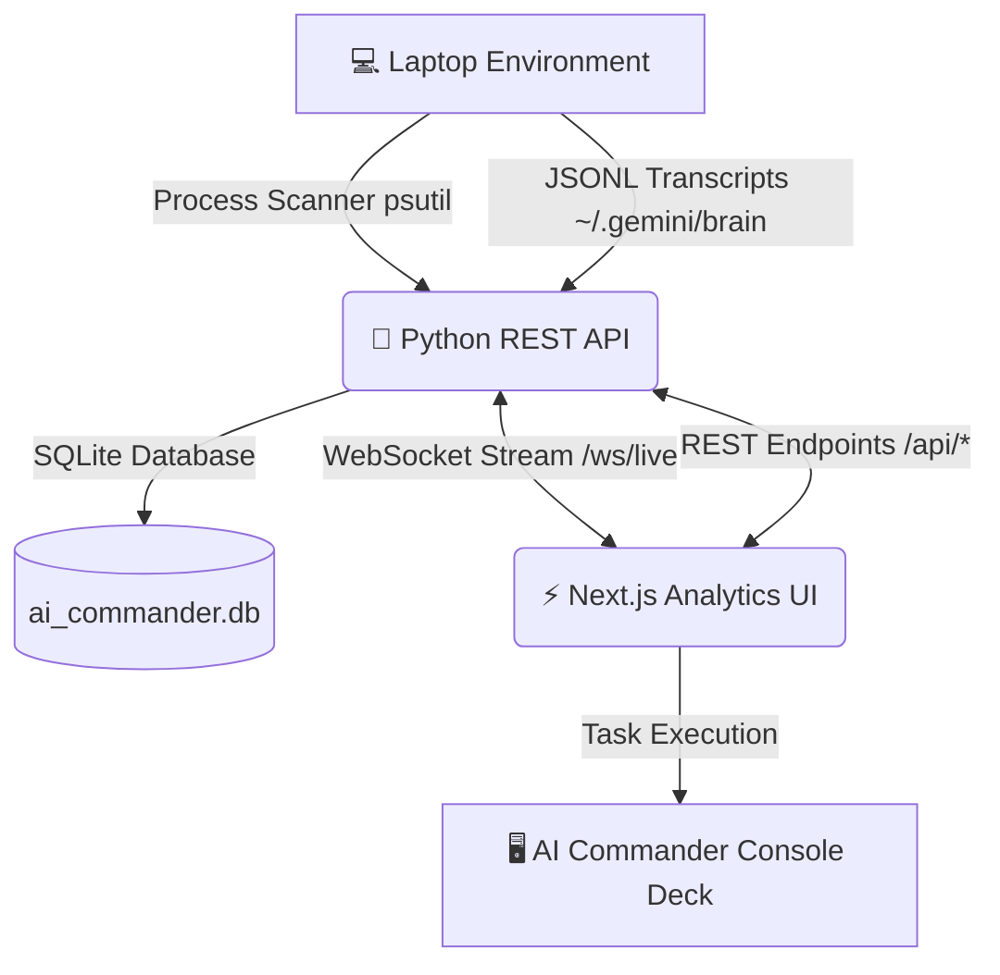
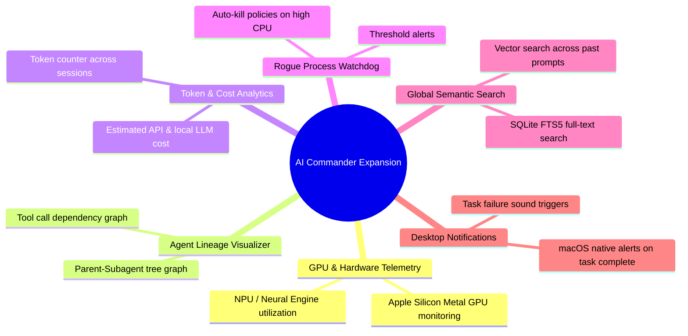

<div align="center">

# ⚡ AI COMMANDER

**Real-time Mission Control & Telemetry Dashboard for Local AI Agents, Tasks & Prompts**

[](https://fastapi.tiangolo.com)
[](https://nextjs.org)
[](https://python.org)
[](https://typescriptlang.org)
[](https://tailwindcss.com)

</div>

---

## 📖 Overview

**AI Commander** is a unified telemetry mission control system built to monitor, audit, and manage all AI agent workflows, background execution tasks, prompt histories, and system resource consumption on your laptop.

It combines a **Python REST API + WebSockets backend** with a **Next.js 16 analytics dashboard**, providing real-time process scanning, transcript log indexing, and prompt tracking.



---

## ⚡ Current Core Capabilities

| Module | Features & Capabilities |
| :--- | :--- |
| **🖥️ System Telemetry** | Real-time tracking of CPU utilization, RAM usage (GB used/total), Disk space, active process count, and live WebSocket telemetry metrics. |
| **🔍 AI Process Scanner** | Auto-detects local LLM servers (Ollama, vLLM, LM Studio), AGY / Antigravity Agents, Claude/Cursor extensions, Python AI scripts, and vector databases. Provides PID, command line inspection, and one-click process termination. |
| **📚 Prompt Vault** | Automatically parses and indexes all user prompts from agent transcripts into SQLite. Supports prompt search, bookmarking, character length analytics, and copy-to-clipboard. |
| **📜 Agent Log Explorer** | Deep step-by-step transcript viewer for session JSONL files. Filter steps by User Prompts, Model Answers, Tool Calls (`run_command`, `replace_file_content`), and Subagent events. |
| **🎮 Commander Console Deck** | Execute background shell commands, run python AI diagnostics, check installed models, and view live stdout/stderr streams. |

---

## 🔮 Roadmap: Future Feature Expansion Ideas

Here are powerful feature enhancements planned for **AI Commander**:



### 1. 🏎️ GPU & Apple Silicon Metal Hardware Telemetry
- **Apple Silicon (M1/M2/M3/M4) GPU Monitoring**: Integrate `powermetrics` / `system_profiler` to track GPU core load %, Metal memory usage, and Neural Engine (NPU) inference power consumption.
- **NVIDIA CUDA Stats**: For Linux/Windows nodes, add `pynvml` integration for VRAM, GPU temperature, and tensor core utilization.

### 2. 🌳 Multi-Agent Lineage & Subagent Visualizer
- **Tree Hierarchy**: Render an interactive node graph showing parent agent -> subagent relationships, delegated task scopes, and tool execution dependencies.
- **Live Lifecycle Status**: Highlight running, idle, completed, or errored subagents in real-time.

### 3. 📊 Token & Cost Estimator Dashboard
- **Token Counter**: Calculate total input (prompt) and output (completion) tokens used per session and model provider.
- **Cost Metrics**: Track estimated dollar cost for API providers (OpenAI, Anthropic, Gemini) vs local zero-cost LLMs (Ollama).

### 4. 🐕 Rogue Process Watchdog & Auto-Kill Policies
- **Threshold Rules**: Define automated rules (e.g. *"If any Python or Ollama process exceeds 90% CPU for > 5 minutes, auto-throttle or send alert"*).
- **Auto-Cleanup**: Automatically release zombie child processes when an agent finishes.

### 5. 🔍 Global Semantic Log & Prompt Search Engine
- **SQLite FTS5 Full-Text Search**: Instant search across millions of lines of transcript logs, code snippets, and generated diffs.
- **Vector Indexing**: Local embeddings (via `sentence-transformers` / `chromadb`) to perform semantic search for past solutions and prompt patterns.

### 6. 🔔 macOS Native Desktop Notifications
- **System Alerts**: Send native macOS banner notifications when a long-running AI task completes, fails, or requires user input.

---

## 🚀 Quick Start Guide

### Prerequisites
- **Python**: 3.10+ (Tested on Python 3.14)
- **Node.js**: v18+ (Tested on Node v26)

### One-Click Launch

Run the startup script from the root directory:

```bash
./start_ai_commander.sh
```

### Access Ports

| Interface | URL | Description |
| :--- | :--- | :--- |
| **Next.js Analytics UI** | [http://localhost:3000](http://localhost:3000) | Main Telemetry Dashboard |
| **FastAPI REST API Docs** | [http://localhost:8000/docs](http://localhost:8000/docs) | Interactive OpenAPI Documentation |
| **WebSocket Telemetry** | `ws://localhost:8000/ws/live` | Real-time metric stream |

---

## 📡 REST API Reference

| Method | Endpoint | Description |
| :--- | :--- | :--- |
| `GET` | `/api/system/stats` | Returns CPU%, RAM%, Disk% telemetry |
| `GET` | `/api/processes?all=false` | Returns list of running AI processes & tasks |
| `POST` | `/api/processes/{pid}/kill` | Terminates process by PID |
| `GET` | `/api/prompts` | Searches and returns prompt vault items |
| `POST` | `/api/prompts/{id}/favorite` | Toggles prompt bookmark |
| `GET` | `/api/prompts/analytics` | Returns prompt usage statistics |
| `GET` | `/api/sessions` | Returns list of discovered AI agent sessions |
| `GET` | `/api/sessions/{id}/logs` | Returns parsed JSONL transcript steps |
| `POST` | `/api/commander/run` | Executes command line instruction |
| `WS` | `/ws/live` | WebSocket connection streaming telemetry |

---

## 📂 Project Architecture

```
ai-commander/
├── backend/                  # Python REST API Backend
│   ├── venv/                 # Virtual Environment
│   ├── main.py               # FastAPI Router & WebSocket Server
│   ├── process_tracker.py    # psutil System & AI Process Scanner
│   ├── log_monitor.py        # Transcript JSONL & Log Parser
│   ├── prompt_tracker.py     # SQLite Database & Prompt Analytics
│   ├── commander_service.py  # Shell Task Execution Service
│   ├── requirements.txt      # Python Dependencies
│   └── ai_commander.db       # SQLite Database
│
├── frontend/                 # Next.js 16 Web UI Frontend
│   ├── app/                  # App Router Pages
│   │   ├── page.tsx          # Telemetry Dashboard
│   │   ├── tasks/page.tsx    # Process & Task Manager
│   │   ├── prompts/page.tsx  # Prompt Vault & Tracker
│   │   ├── logs/page.tsx     # Agent Transcripts Explorer
│   │   └── commander/page.tsx# Commander Console Deck
│   ├── components/           # Navbar & UI Analytics Components
│   └── lib/api.ts            # REST & WebSocket API Client
│
├── start_ai_commander.sh     # One-Click Startup Script
├── .gitignore                # Root Git Ignore
└── README.md                 # Project Documentation
```

---

<div align="center">

**AI Commander** &bull; Built with Python REST API & Next.js 16 Analytics

</div>
