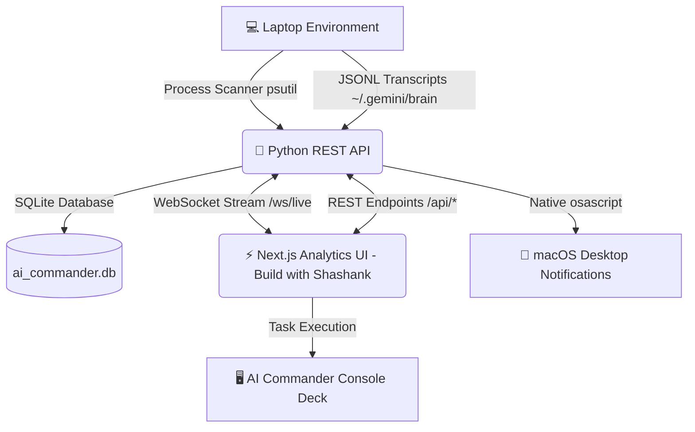

<div align="center">

# ⚡ AI COMMANDER

### **Build with Shashank** &bull; [www.buildwithshashank.com](https://www.buildwithshashank.com/)

**The Ultimate Local Mission Control & Telemetry Dashboard for AI Agents, Tasks & Prompts**

[](https://www.buildwithshashank.com/)
[](https://fastapi.tiangolo.com)
[](https://nextjs.org)
[](https://python.org)
[](https://typescriptlang.org)

</div>

---

## 💎 Unique Selling Proposition (USP)

What makes **AI Commander** stand out from traditional process managers or agent CLI tools?

```
┌─────────────────────────────────────────────────────────────────────────────┐
│                          AI COMMANDER CORE USPs                             │
├──────────────────────────────┬──────────────────────────────┬───────────────┤
│ 🔒 100% Local & Private      │ 🐕 Rogue Process Watchdog    │ 📊 Token Cost │
│ Runs entirely on your laptop │ Auto-detects & kills high-   │ Calculates API│
│ with zero external telemetry │ CPU runaway agent workers    │ cost savings  │
├──────────────────────────────┼──────────────────────────────┼───────────────┤
│ 📜 Global Log Search Engine  │ 🌳 Subagent Lineage Tree     │ 📄 1-Click    │
│ Instant cross-session search │ Visualizes parent->subagent  │ Markdown Audit│
│ across transcripts & code    │ delegation & tool history    │ Report Export │
└──────────────────────────────┴──────────────────────────────┴───────────────┘
```

1. **🔒 100% Local & Privacy-First Auditability**:
   - Analyzes your local system environment (`psutil`, `~/.gemini/antigravity-cli/brain/`) without transmitting prompt histories, code snippets, or system logs to cloud servers.

2. **🐕 Rogue AI Process Watchdog**:
   - Protects your laptop from runaway AI processes, memory leaks, and high CPU loops. Features 1-click **Auto-Kill** policies for processes consuming >85% CPU.

3. **📊 Token Consumption & Cost Estimator**:
   - Real-time token counter calculating exact input/output tokens and estimating dollar savings achieved by running local AI models vs cloud API rates.

4. **🔍 Cross-Session Global Log Search**:
   - Instantly search through millions of lines of AI agent execution steps, tool call parameters (`run_command`, `replace_file_content`), and code diffs across all past sessions.

5. **🌳 Subagent Lineage Tree Visualizer**:
   - Automatically parses agent sub-delegations (`invoke_subagent`), mapping parent sessions to subagent roles, prompts, and model parameters.

6. **📄 Compliance Audit Report Exporter**:
   - One-click export of complete session execution timelines into clean, formatted **Markdown Audit Reports**.

---

## ⚡ Feature Matrix

| Feature Module | Capabilities |
| :--- | :--- |
| **🖥️ Hardware Telemetry** | Real-time tracking of CPU load %, Memory (GB used/total), Disk free space, and **Apple Silicon (M1/M2/M3/M4)** chip specs. |
| **🔍 Process Watchdog** | Auto-detects local LLM servers (Ollama, vLLM, LM Studio), AGY / Antigravity Agents, Claude/Cursor extensions, Python AI scripts, and vector databases. Provides PID, command line inspection, and Watchdog Auto-Kill. |
| **📚 Prompt Vault** | Indexes all user prompts given across sessions into a persistent SQLite database (`ai_commander.db`) with bookmarking, tagging, length analytics, and prompt copy/reuse. |
| **📜 Agent Log Explorer** | Line-by-line JSONL log viewer filtering steps by User Prompts, Model Answers, Tool Executions, and Subagents with line-number precision (`#Line 42`). |
| **🚀 AI Agent Launcher Console** | Trigger pre-configured AI agent workers or launch custom Python AI scripts directly from the web browser with real-time stdout/stderr output streams. |
| **🔔 Desktop Notifications** | Sends native macOS notifications via `osascript` when background AI tasks complete, fail, or time out. |
| **💾 Storage Footprint Monitor** | Scans and displays storage footprint occupied by AI session transcripts and scratch files (`~/.gemini/antigravity-cli/brain/`). |

---

## 🏗️ System Architecture



---

## 🚀 Quick Start Guide

### Prerequisites
- **Python**: 3.10+ (Tested on Python 3.14)
- **Node.js**: v18+ (Tested on Node v26)

### One-Click Launch

Run the startup script from the root directory:

```bash
./start_ai_commander.sh
```

### Access Ports

| Interface | URL | Description |
| :--- | :--- | :--- |
| **Next.js Analytics UI** | [http://localhost:3000](http://localhost:3000) | Main Telemetry Dashboard |
| **FastAPI REST API Docs** | [http://localhost:8000/docs](http://localhost:8000/docs) | Interactive OpenAPI Documentation |
| **WebSocket Telemetry** | `ws://localhost:8000/ws/live` | Real-time metric stream |
| **Official Site** | [www.buildwithshashank.com](https://www.buildwithshashank.com/) | Build with Shashank Platform |

---

## 📡 REST API Reference

| Method | Endpoint | Description |
| :--- | :--- | :--- |
| `GET` | `/api/system/stats` | Returns CPU%, RAM%, Disk% telemetry |
| `GET` | `/api/hardware` | Returns Apple Silicon hardware info & core specs |
| `GET` | `/api/storage` | Returns log storage footprint and directory sizes |
| `GET` | `/api/ollama/models` | Lists discovered local Ollama models |
| `GET` | `/api/processes?all=false` | Returns list of running AI processes & tasks |
| `POST` | `/api/processes/{pid}/kill` | Terminates process by PID |
| `POST` | `/api/watchdog/autokill` | Auto-kills high resource rogue AI processes (>85% CPU) |
| `GET` | `/api/prompts` | Searches and returns prompt vault items |
| `POST` | `/api/prompts/{id}/favorite` | Toggles prompt bookmark |
| `GET` | `/api/analytics/tokens` | Returns token consumption & cost estimator analytics |
| `GET` | `/api/sessions` | Returns list of discovered AI agent sessions |
| `GET` | `/api/sessions/{id}/logs` | Returns parsed JSONL transcript steps |
| `GET` | `/api/sessions/{id}/export` | Exports session transcript as Markdown report |
| `GET` | `/api/logs/search?q=query` | Searches across all transcript steps |
| `POST` | `/api/commander/run` | Executes command line instruction |
| `WS` | `/ws/live` | WebSocket connection streaming telemetry |

---

<div align="center">

**AI Commander** &bull; [Build with Shashank](https://www.buildwithshashank.com/)

</div>
