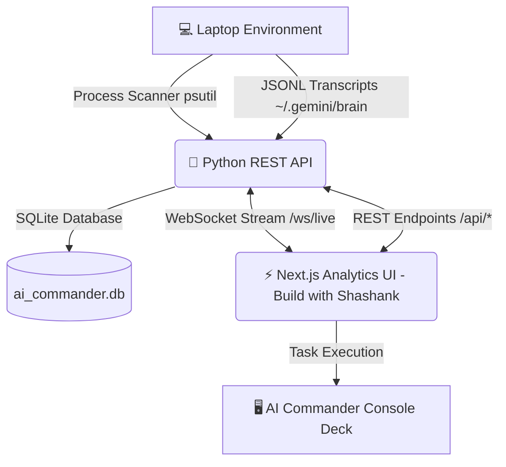

<div align="center">

# ⚡ AI COMMANDER

### **Build with Shashank** &bull; [ai.buildwithshashank.com](https://ai.buildwithshashank.com/)

**Real-time Mission Control & Telemetry Dashboard for Local AI Agents, Tasks & Prompts**

[](https://ai.buildwithshashank.com/)
[](https://fastapi.tiangolo.com)
[](https://nextjs.org)
[](https://python.org)

</div>

---

## 📖 Overview

**AI Commander** (by [Build with Shashank](https://ai.buildwithshashank.com/)) is a unified telemetry mission control system built to monitor, audit, and manage all AI agent workflows, background execution tasks, prompt histories, and system resource consumption on your laptop.

It combines a **Python REST API + WebSockets backend** with a **Next.js 16 analytics dashboard**, providing real-time process scanning, transcript log indexing, and prompt tracking.



---

## ⚡ Current Core Capabilities

| Module | Features & Capabilities |
| :--- | :--- |
| **🖥️ System Telemetry** | Real-time tracking of CPU utilization, RAM usage (GB used/total), Disk space, active process count, and live WebSocket telemetry metrics. |
| **🔍 AI Process Scanner & Watchdog** | Auto-detects local LLM servers (Ollama, vLLM, LM Studio), AGY / Antigravity Agents, Claude/Cursor extensions, Python AI scripts, and vector databases. Provides PID, command line inspection, and 1-click Watchdog Auto-Kill for high-CPU rogue processes. |
| **📚 Prompt Vault & Token Estimator** | Automatically parses and indexes all user prompts from agent transcripts into SQLite. Calculates total input/output tokens and estimated API cost savings. |
| **📜 Agent Log Explorer** | Deep step-by-step transcript viewer for session JSONL files. Filter steps by User Prompts, Model Answers, Tool Calls (`run_command`, `replace_file_content`), and Subagent events. Includes Global Search & Markdown Report Exporter. |
| **🎮 Commander Console Deck** | Execute background shell commands, run python AI diagnostics, check installed models, and view live stdout/stderr streams with macOS desktop notifications. |

---

## 🚀 Quick Start Guide

### Prerequisites
- **Python**: 3.10+ (Tested on Python 3.14)
- **Node.js**: v18+ (Tested on Node v26)

### One-Click Launch

Run the startup script from the root directory:

```bash
./start_ai_commander.sh
```

### Access Ports

| Interface | URL | Description |
| :--- | :--- | :--- |
| **Next.js Analytics UI** | [http://localhost:3000](http://localhost:3000) | Main Telemetry Dashboard |
| **FastAPI REST API Docs** | [http://localhost:8000/docs](http://localhost:8000/docs) | Interactive OpenAPI Documentation |
| **WebSocket Telemetry** | `ws://localhost:8000/ws/live` | Real-time metric stream |
| **Official Site** | [ai.buildwithshashank.com](https://ai.buildwithshashank.com/) | Build with Shashank Platform |

---

## 📡 REST API Reference

| Method | Endpoint | Description |
| :--- | :--- | :--- |
| `GET` | `/api/system/stats` | Returns CPU%, RAM%, Disk% telemetry |
| `GET` | `/api/hardware` | Returns Apple Silicon hardware info & core specs |
| `GET` | `/api/storage` | Returns log storage footprint and directory sizes |
| `GET` | `/api/processes?all=false` | Returns list of running AI processes & tasks |
| `POST` | `/api/processes/{pid}/kill` | Terminates process by PID |
| `POST` | `/api/watchdog/autokill` | Auto-kills high resource rogue AI processes (>85% CPU) |
| `GET` | `/api/prompts` | Searches and returns prompt vault items |
| `POST` | `/api/prompts/{id}/favorite` | Toggles prompt bookmark |
| `GET` | `/api/analytics/tokens` | Returns token consumption & cost estimator analytics |
| `GET` | `/api/sessions` | Returns list of discovered AI agent sessions |
| `GET` | `/api/sessions/{id}/logs` | Returns parsed JSONL transcript steps |
| `GET` | `/api/sessions/{id}/export` | Exports session transcript as Markdown report |
| `GET` | `/api/logs/search?q=query` | Searches across all transcript steps |
| `POST` | `/api/commander/run` | Executes command line instruction |
| `WS` | `/ws/live` | WebSocket connection streaming telemetry |

---

<div align="center">

**AI Commander** &bull; [Build with Shashank](https://ai.buildwithshashank.com/)

</div>
